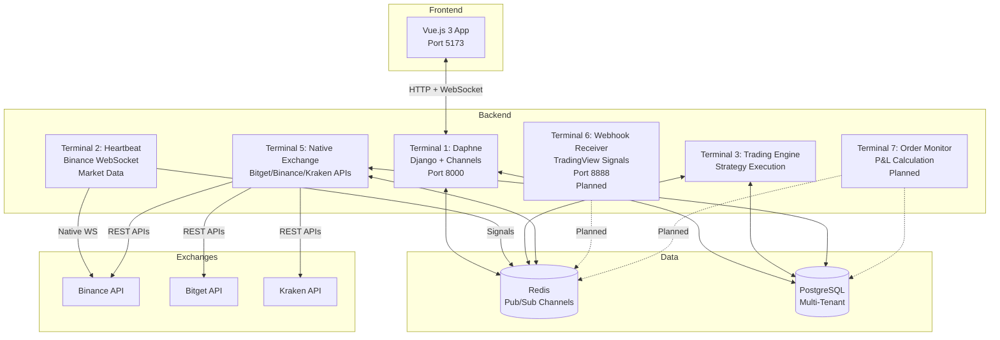
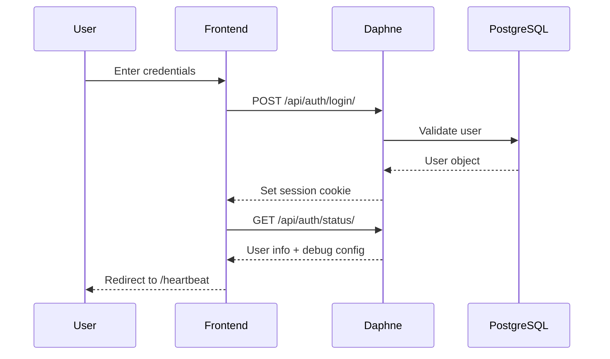
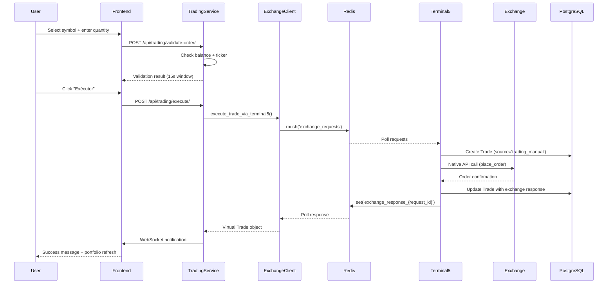
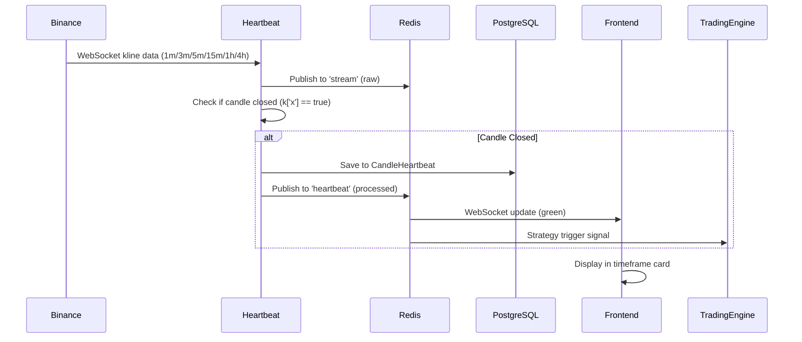
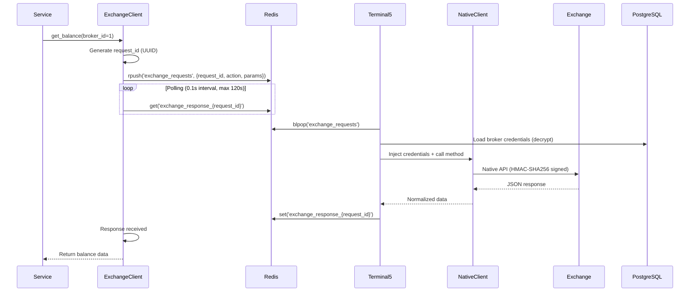

# Aristobot3.1 Codebase Map

> Auto-generated by Cartographer. Last mapped: January 15, 2026 (Post-refactoring CCXT → Exchange)

## System Overview

Aristobot3.1 is a personal crypto trading bot built with Django/Vue.js, supporting multi-exchange automated trading strategies. The architecture follows a **7-terminal microservice** pattern with native exchange APIs for high performance (~3x faster than CCXT).

**Philosophy**: "Vibe Coding" - Pragmatic > Enterprise, Shipping > Process, Fun > Perfection

**Scale**: 5 users max, 20 active strategies limit

**Status**: ✅ Modules 1-3 Complete | 🚧 Modules 4-8 Planned



---

## Directory Structure

```
Aristobot3/
├── backend/                          # Django backend (592k tokens)
│   ├── aristobot/                    # Main Django project
│   │   ├── settings.py              # Central config (multi-tenant, CORS, Channels)
│   │   ├── asgi.py                  # ASGI entry point for Daphne
│   │   └── routing.py               # WebSocket URL routing
│   ├── apps/                        # 8 Django apps
│   │   ├── core/                    # Core services & models (48k tokens)
│   │   │   ├── models.py            # HeartbeatStatus, Position, CandleHeartbeat
│   │   │   ├── consumers.py         # 4 WebSocket consumers
│   │   │   ├── services/            # Native exchange clients
│   │   │   │   ├── base_exchange_client.py    # Factory pattern (6.9k)
│   │   │   │   ├── bitget_native_client.py    # Bitget API (15.2k)
│   │   │   │   ├── binance_native_client.py   # Binance API (9.6k)
│   │   │   │   ├── kraken_native_client.py    # Kraken API (10.1k)
│   │   │   │   ├── native_exchange_manager.py # Pool manager (13.1k)
│   │   │   │   └── exchange_client.py         # Exchange compatibility layer (4.4k)
│   │   │   └── management/commands/
│   │   │       ├── run_heartbeat.py           # Terminal 2 (1.2k)
│   │   │       ├── run_native_exchange_service.py  # Terminal 5 (2.8k)
│   │   │       └── run_order_monitor.py       # Terminal 7 (11.1k) - Planned
│   │   ├── accounts/                # User accounts (2.8k tokens)
│   │   ├── auth_custom/             # Debug mode auth (1.8k tokens)
│   │   ├── brokers/                 # Exchange config (4.9k tokens)
│   │   ├── trading_manual/          # Manual trading UI (26.4k tokens)
│   │   ├── trading_engine/          # Strategy execution (0.8k - placeholder)
│   │   ├── strategies/              # Strategy CRUD (empty - planned)
│   │   ├── backtest/                # Backtesting (empty - planned)
│   │   ├── webhooks/                # TradingView signals (empty - planned)
│   │   └── stats/                   # Performance analytics (empty - planned)
│   ├── requirements.txt             # Dependencies (Django 4.2.15, Channels, aiohttp)
│   └── manage.py                    # Django management CLI
│
├── frontend/                        # Vue.js 3 frontend (65k tokens)
│   ├── src/
│   │   ├── main.js                  # App initialization + routing
│   │   ├── App.vue                  # Root component (layout logic)
│   │   ├── stores/
│   │   │   └── auth.js              # Pinia auth store (939 lines)
│   │   ├── components/
│   │   │   ├── Sidebar.vue          # Navigation menu (557 lines)
│   │   │   └── StatusBar.vue        # Top status indicators (877 lines)
│   │   ├── views/
│   │   │   ├── LoginView.vue        # Auth + debug mode ✅ (1.8k)
│   │   │   ├── AccountView.vue      # Brokers CRUD ✅ (10.2k)
│   │   │   ├── HeartbeatView.vue    # Market data ✅ (4.1k)
│   │   │   ├── TradingManualView.vue # Manual trading ✅ (49.7k)
│   │   │   ├── TradingBotView.vue   # Strategy activation 🚧 (58 lines)
│   │   │   ├── StrategiesView.vue   # Code editor 🚧 (58 lines)
│   │   │   ├── BacktestView.vue     # Simulation 🚧 (58 lines)
│   │   │   ├── WebhooksView.vue     # TradingView 🚧 (58 lines)
│   │   │   └── StatsView.vue        # Analytics 🚧 (57 lines)
│   │   ├── api/
│   │   │   └── index.js             # Axios config (CSRF + auth)
│   │   └── design-system/
│   │       └── tokens.js            # Dark theme colors + spacing
│   ├── package.json                 # Vue 3.4, Vite 5, Pinia, Axios
│   ├── vite.config.js               # Vue runtime + feature flags
│   └── index.html                   # Entry HTML (at root, not public/)
│
├── docs/                            # Documentation (100k+ tokens)
│   ├── Aristobot3_1.md             # Main developer guide (23.5k)
│   ├── IMPLEMENTATION_PLAN.md       # Module roadmap (4.1k)
│   ├── MODULE[1-3]_IMPLEMENTATION.md # Completed modules
│   ├── _Archives/                   # Archived documentation
│   ├── Terminal 7 - IMPLEMENTATION.md # Order Monitor spec (9.0k)
│   └── design/README.md             # UI design system (252 lines)
│
├── Start[0-5] *.bat                # Windows startup scripts
├── .env.example                     # Environment template
├── .claude-instructions             # AI development rules (644 lines)
├── .gitignore                       # Security exclusions (711 lines)
└── CLAUDE.md                        # Context loader for AI (177 lines)
```

**Legend**: ✅ Complete | 🚧 Planned | Token counts in parentheses

---

## Core Services (Terminal Architecture)

### Terminal 1: Web Server (Daphne)

**File**: `backend/aristobot/asgi.py`
**Command**: `daphne aristobot.asgi:application`
**Port**: 8000
**Status**: ✅ Active

**Purpose**: Django ASGI server handling HTTP APIs and WebSocket connections

**Key Components**:
- **HTTP**: REST APIs for all Django apps
- **WebSocket**: 8 consumers for real-time updates
- **Authentication**: Django session-based auth (no JWT)
- **Routing**: `aristobot/routing.py` maps WebSocket URLs

**WebSocket Consumers** (`apps/core/consumers.py`):

| Consumer | URL | Purpose |
|----------|-----|---------|
| `HeartbeatConsumer` | `/ws/heartbeat/` | Processed market signals |
| `StreamConsumer` | `/ws/stream/` | Raw Binance data |
| `BacktestConsumer` | `/ws/backtest/` | Backtest progress |
| `UserAccountConsumer` | `/ws/user-account/` | Broker notifications |
| `TradingManualConsumer` | `/ws/trading-manual/` | Price updates |
| `OpenOrdersConsumer` | `/ws/open-orders/` | Order sync |
| `TradingNotificationsConsumer` | `/ws/trading-notifications/` | Execution alerts |
| `Terminal7MonitoringConsumer` | `/ws/terminal7-monitoring/` | P&L updates 🚧 |

---

### Terminal 2: Heartbeat Service

**File**: `backend/apps/core/management/commands/run_heartbeat.py` (1,212 lines)
**Command**: `python manage.py run_heartbeat`
**Status**: ✅ Active

**Purpose**: Market data aggregator from Binance native WebSocket

**Architecture**:
```
Binance WebSocket (wss://stream.binance.com:9443)
    ↓ Subscribes: btcusdt@kline_1m/3m/5m/15m/1h/4h
process_message()
    ├─→ Broadcast raw stream → 'stream' Redis channel
    └─→ If candle closed (k['x'] == true):
        ├─→ Save to CandleHeartbeat table (OHLCV + timestamps)
        └─→ Broadcast processed → 'heartbeat' Redis channel
```

**Database Models** (`apps/core/models.py`):

- **`HeartbeatStatus`** (singleton):
  - Tracks: `is_connected`, `last_application_start/stop`
  - Methods: `record_start()`, `record_stop()`

- **`CandleHeartbeat`**:
  - Fields: `dhm_reception`, `dhm_candle`, `signal_type` (1m/3m/5m/15m/1h/4h)
  - OHLCV data: `open/high/low/close_price`, `volume`
  - Indexes: `(signal_type, -dhm_candle)`, `(symbol, signal_type)`

**Signals Published**:
- `stream` channel: Raw JSON every message
- `heartbeat` channel: Processed candle on close

**Used By**: Terminal 3 (Trading Engine), Frontend (HeartbeatView)

---

### Terminal 3: Trading Engine

**File**: `backend/apps/core/management/commands/run_trading_engine.py` (881 lines - placeholder)
**Command**: `python manage.py run_trading_engine`
**Status**: 🚧 Planned (Module 5-7)

**Purpose**: Execute active trading strategies triggered by Heartbeat signals

**Planned Workflow**:
```
Listen: Redis 'heartbeat' channel
    ↓ Signal received (e.g., "5m" close)
Load active_strategies WHERE:
    - is_active = True
    - timeframe = '5m'
    - start_date <= NOW <= end_date
    ↓
For each strategy:
    1. Load code from strategies table
    2. Execute via exec() in isolated namespace
    3. Evaluate should_long() / should_short()
    4. Calculate position_size, stop_loss, take_profit
    5. Send order via ExchangeClient → Terminal 5
```

**Dependencies**:
- `apps/strategies` models (Module 5)
- `apps/core/services/exchange_client.py` for orders

---

### Terminal 4: Frontend (Vite Dev Server)

**Directory**: `frontend/`
**Command**: `npm run dev`
**Port**: 5173
**Status**: ✅ Active

**Purpose**: Vue.js 3 Composition API interface

**Stack**:
- **Framework**: Vue 3.4.0 (Composition API only)
- **Router**: Vue Router 4.2.5
- **State**: Pinia 2.1.7
- **HTTP**: Axios 1.6.0 (withCredentials for Django sessions)
- **Build**: Vite 5.0.0 (dev server + HMR)

**Architecture**:
```
App.vue (Root layout)
    ├─→ Sidebar.vue (Navigation menu)
    ├─→ StatusBar.vue (Top indicators: Heartbeat, Debug, User)
    └─→ <router-view> (Current page)
        ├─→ LoginView.vue ✅
        ├─→ AccountView.vue ✅ (Broker CRUD)
        ├─→ HeartbeatView.vue ✅ (Market data)
        ├─→ TradingManualView.vue ✅ (Portfolio + Orders)
        └─→ [5 placeholder views] 🚧
```

**State Management** (`stores/auth.js`):
- `user`, `isLoading`, `error`, `debugConfig`
- Actions: `login()`, `logout()`, `debugLogin()`, `checkAuth()`

**API Configuration** (`api/index.js`):
- Base URL: `http://localhost:8000`
- Timeout: 30s (for symbol loading)
- CSRF token auto-injection from cookies

---

### Terminal 5: Native Exchange Gateway ⭐

**File**: `backend/apps/core/management/commands/run_native_exchange_service.py` (2,877 lines)
**Command**: `python manage.py run_native_exchange_service --verbose`
**Status**: ✅ Active (Native architecture)

**Purpose**: Centralized native exchange API gateway with connection pooling

**Architecture Innovation**:
```
NativeExchangeManager (Singleton)
    ├─→ exchanges: Dict[str, BaseExchangeClient]
    │   ├─→ 'bitget': BitgetNativeClient (shared)
    │   ├─→ 'binance': BinanceNativeClient (shared)
    │   └─→ 'kraken': KrakenNativeClient (shared)
    ├─→ broker_cache: Dict[int, Broker]
    └─→ Redis listener: exchange_requests → exchange_responses
```

**Key Innovation**: One client instance per exchange type (not per broker), with dynamic credential injection per request.

**Example**:
- Broker 1: bitget/user1 → Uses shared BitgetNativeClient
- Broker 2: bitget/user2 → Uses **same** shared BitgetNativeClient
- Credentials injected before each API call

**Performance**: High-performance native APIs (354ms average for balance queries)

**Native Clients** (`apps/core/services/`):

| Client | File | Tokens | Exchange | Features |
|--------|------|--------|----------|----------|
| `BitgetNativeClient` | `bitget_native_client.py` | 15,272 | Bitget v2 Spot | HMAC-SHA256, OCO orders, tpsl_type |
| `BinanceNativeClient` | `binance_native_client.py` | 9,665 | Binance v3 Spot | Weight-based rate limiting |
| `KrakenNativeClient` | `kraken_native_client.py` | 10,147 | Kraken v0 | HMAC-SHA512 + base64 |
| `NativeExchangeManager` | `native_exchange_manager.py` | 13,183 | All | Pool manager, Redis handler |
| `ExchangeClient` | `exchange_client.py` | 4,429 | All | Unified exchange interface |

**Actions Supported**:
- `get_balance`, `get_markets`, `get_ticker`, `fetch_tickers`, `get_candles`
- `place_order`, `cancel_order`, `edit_order`
- `fetch_open_orders`, `fetch_closed_orders`
- `test_connection` (User Account validation)
- `load_markets` (Background symbol sync)
- `create_and_execute_trade` (Trading Manual)

**Communication Protocol**:
```python
# Service → Terminal 5
redis.rpush('exchange_requests', json.dumps({
    'request_id': uuid4(),
    'action': 'place_order',
    'params': {...},
    'user_id': 123  # Multi-tenant security
}))

# Terminal 5 → Service
redis.set(f"exchange_response_{request_id}", json.dumps({
    'success': True,
    'data': {...}
}))
```

**Used By**: All trading services (TradingService, Trading Engine, Backtest, Webhooks)

---

### Terminal 6: Webhook Receiver (Planned)

**File**: Not yet implemented
**Command**: `python manage.py run_webhook_receiver`
**Port**: 8888
**Status**: 🚧 Planned (Module 4)

**Purpose**: Lightweight HTTP server for TradingView webhook ingestion

**Architecture**:
```
TradingView → HTTP POST :8888
    ↓
WebhookReceiver (aiohttp/FastAPI)
    ├─→ Validate auth token
    ├─→ Publish to Redis 'webhook_raw'
    └─→ Return 200 OK (< 50ms)

Terminal 3 (Trading Engine)
    ├─→ Listens to 'webhook_raw' channel
    ├─→ Validates webhook payload
    ├─→ Executes trading logic
    └─→ Saves to webhooks table
```

**Key Principle**: No business logic, just receive → Redis → respond

---

### Terminal 7: Order Monitor (Planned)

**File**: `backend/apps/core/management/commands/run_order_monitor.py` (11,130 lines - spec complete)
**Command**: `python manage.py run_order_monitor`
**Status**: 🚧 Spec complete, implementation pending

**Purpose**: Automatic order detection and P&L calculation

**Workflow**:
```
Internal 10-second timer
    ↓
For each active broker (sequential, 1s delay):
    1. Fetch open orders via Terminal 5
    2. Fetch closed orders (last fill timestamp + 30min window)
    3. Detect newly filled orders:
        a. Compare with Trade table (source='order_monitor')
        b. If missing → Import as new trade
        c. If status changed (open → filled) → Update
    4. Calculate P&L:
        Phase 1: Price Averaging
        Phase 2: FIFO (First In First Out)
        Phase 3: User choice
    5. Save to Trade model:
        - source='order_monitor'
        - ordre_existant='Ajouté par Terminal 7'
        - realized_pnl, pnl_calculation_method
    6. WebSocket notification → Frontend positions tab
```

**Database Impact**: Populates `Trade` model with exchange-detected orders

**Used By**: Frontend TradingManualView.vue (positions tab)

---

## Module Guide

### Module 1: User Account & Brokers ✅ Complete

**Purpose**: Multi-tenant authentication and broker configuration

**Key Files**:

| File | Purpose | Tokens |
|------|---------|--------|
| `apps/accounts/models.py` | Extended User model (AI config, timezone) | 581 |
| `apps/auth_custom/models.py` | DebugMode singleton | 305 |
| `apps/auth_custom/views.py` | Debug login endpoints | 1,536 |
| `apps/brokers/models.py` | Broker + ExchangeSymbol models | 1,573 |
| `apps/brokers/views.py` | Broker CRUD + capabilities API | 2,314 |
| `apps/accounts/management/commands/init_aristobot.py` | Bootstrap script | 480 |

**Features**:
- ✅ Django session authentication
- ✅ DEBUG mode (auto-login as "dev" user)
- ✅ Broker CRUD with encrypted API keys (Fernet + Django SECRET_KEY)
- ✅ Test connection endpoint (`/api/brokers/{id}/test_connection/`)
- ✅ Exchange capabilities matrix (`/api/brokers/{id}/capabilities/`)
- ✅ Symbol updater service (background sync to `ExchangeSymbol` table)

**Frontend**: `AccountView.vue` (10,289 tokens)

**Security**:
- API keys encrypted at rest
- Multi-tenant: `Broker.objects.filter(user=request.user)`
- CSRF exempt for API (custom SessionAuthentication)

---

### Module 2: Heartbeat Enhanced ✅ Complete

**Purpose**: Persistent market data aggregation with dual-channel WebSocket

**Key Files**:

| File | Purpose | Tokens |
|------|---------|--------|
| `apps/core/models.py` | CandleHeartbeat model | 1,318 |
| `apps/core/management/commands/run_heartbeat.py` | Service command | 1,212 |
| `apps/core/consumers.py` | HeartbeatConsumer + StreamConsumer | 542 |
| `apps/core/views.py` | /api/heartbeat-history/ API | 1,265 |

**Features**:
- ✅ Native Binance WebSocket (multi-timeframe subscription)
- ✅ OHLCV persistence in `CandleHeartbeat` table
- ✅ Dual-channel broadcasting:
  - `stream` → Raw Binance data
  - `heartbeat` → Processed closed candles
- ✅ Historical data API (240 signals default)
- ✅ Frontend with orange (historical) + green (live) differentiation

**Frontend**: `HeartbeatView.vue` (4,138 tokens)

**Data Flow**:
```
Binance WS → process_message()
    ├─→ Save to CandleHeartbeat (DB)
    ├─→ Publish to 'stream' (Redis)
    └─→ Publish to 'heartbeat' (Redis)
        ↓
Frontend receives via ws://localhost:8000/ws/heartbeat/
```

---

### Module 2b: Native Exchange Service ✅ Complete

**Purpose**: High-performance native exchange APIs

**Key Files**:

| File | Purpose | Tokens |
|------|---------|--------|
| `apps/core/services/base_exchange_client.py` | Factory pattern | 6,930 |
| `apps/core/services/bitget_native_client.py` | Bitget API | 15,272 |
| `apps/core/services/binance_native_client.py` | Binance API | 9,665 |
| `apps/core/services/kraken_native_client.py` | Kraken API | 10,147 |
| `apps/core/services/native_exchange_manager.py` | Pool manager | 13,183 |
| `apps/core/services/exchange_client.py` | Unified interface | 4,429 |
| `apps/core/management/commands/run_native_exchange_service.py` | Terminal 5 | 2,877 |

**Implementation Status**:
- ✅ Complete: Sept 2025
- 📈 Performance: 354ms average response time
- 🚀 Active: `run_native_exchange_service.py` (Terminal 5)

**Architecture**:
- Native clients, one instance per exchange type + dynamic credentials
- Shared connection pool for all users
- **Refactoring**: January 2026 - All CCXT references replaced with Exchange nomenclature
- Redis channels: `exchange_requests`/`exchange_responses` (formerly `ccxt_*`)

**Key Changes**:
- `CCXTClient` → `ExchangeClient` (compatibility layer)
- `self.ccxt_client` → `self.exchange_client` (all services)
- CCXT retained for metadata only (exchange list, validation)

---

### Module 3: Trading Manual ✅ Complete

**Purpose**: Manual trade execution with real-time portfolio tracking

**Key Files**:

| File | Purpose | Tokens |
|------|---------|--------|
| `apps/trading_manual/models.py` | Trade model (260 fields) | 2,466 |
| `apps/trading_manual/views.py` | 10+ API endpoints | 9,188 |
| `apps/trading_manual/services/trading_service.py` | Trade execution logic | 10,874 |
| `apps/trading_manual/services/portfolio_service.py` | Portfolio + batch pricing | 879 |
| `apps/trading_manual/consumers.py` | 4 WebSocket consumers | 5,749 |

**Features**:
- ✅ Portfolio display with batch price loading (single `get_tickers()` call)
- ✅ Symbol filtering (USDT/USDC/All) + debounced search
- ✅ Order placement (market/limit) via Terminal 5
- ✅ Two-step validation (Valider → Exécuter with 15s window)
- ✅ Order history (toggle: open only / last 30 days closed)
- ✅ WebSocket notifications (execution success/error)

**Frontend**: `TradingManualView.vue` (49,725 tokens - largest file)

**Trade Lifecycle**:
```
Frontend → TradingService.execute_trade_via_terminal5()
    ↓
ExchangeClient → Redis 'exchange_requests'
    ↓
Terminal 5: create_and_execute_trade
    ├─→ Create Trade in DB (source='trading_manual')
    ├─→ Execute on exchange (native API)
    ├─→ Enrich Trade with exchange response
    └─→ Publish response to Redis
        ↓
TradingService receives virtual Trade object
    ↓
WebSocket notification → Frontend
```

**Key Innovation**: Trading Manual no longer creates `Trade.objects.create()` locally - Terminal 5 is master of trade persistence.

---

### Module 4: Webhooks (Planned) 🚧

**Priority**: 1 (Next after Module 3)

**Purpose**: Receive TradingView alerts and execute automated trades

**Planned Files**:
- `apps/webhooks/models.py` - Webhook + WebhookTrade models
- `apps/webhooks/views.py` - Webhook log APIs
- `apps/core/management/commands/run_webhook_receiver.py` - Terminal 6
- `frontend/src/views/WebhooksView.vue` - Monitoring UI

**Architecture**:
```
TradingView → POST :8888/webhook/
    ↓
Terminal 6 (Webhook Receiver)
    ├─→ Validate token
    ├─→ Publish to Redis 'webhook_raw'
    └─→ Return 200 OK
        ↓
Terminal 3 (Trading Engine)
    ├─→ Listen to 'webhook_raw'
    ├─→ Execute webhook logic
    ├─→ Send orders via Terminal 5
    └─→ Save to webhooks table
```

**JSON Payload Example** (from docs):
```json
{
  "Symbol": "BTCUSDT",
  "Exchange": "BINANCE",
  "Action": "BuyMarket",
  "Prix": 60000,
  "PrixSL": 59000,
  "PrixTP": 61000,
  "PourCent": 50,
  "UserID": 1,
  "UserExchangeID": 5,
  "IndicateurName": "RSI_Divergence"
}
```

---

### Module 5: Strategies (Planned) 🚧

**Priority**: 2

**Purpose**: Python code editor for custom trading strategies with AI assistance

**Planned Files**:
- `apps/strategies/models.py` - Strategy model with Python code
- `apps/strategies/views.py` - CRUD + syntax validation
- `frontend/src/views/StrategiesView.vue` - Code editor + AI assistant

**Strategy Template**:
```python
class MyStrategy(Strategy):
    def __init__(self, candles, balance, position=None):
        self.candles = candles  # Pandas DataFrame
        self.balance = balance
        self.position = position

    def should_long(self) -> bool:
        # Buy signal logic
        return False

    def should_short(self) -> bool:
        # Sell signal logic
        return False

    def calculate_position_size(self) -> float:
        return self.balance * 0.1

    def calculate_stop_loss(self) -> float:
        return 0.02  # 2%

    def calculate_take_profit(self) -> float:
        return 0.04  # 4%
```

**AI Integration**:
- OpenRouter API or Ollama local LLM
- Natural language → Python code generation
- Syntax validation via `ast.parse()`

---

### Module 6: Backtest (Planned) 🚧

**Priority**: 4 (after strategies validated in production)

**Purpose**: Simulate strategies on historical data

**Planned Files**:
- `apps/backtest/models.py` - BacktestResult model
- `apps/backtest/views.py` - Execution API
- `frontend/src/views/BacktestView.vue` - UI with progress

**Features**:
- Load historical candles from `Candle` table
- Execute strategy logic in simulation
- Calculate performance metrics (Sharpe ratio, max drawdown, win rate)
- Real-time progress via WebSocket
- Interruptible execution

---

### Module 7: Trading Bot (Planned) 🚧

**Priority**: 3 (after strategies implemented)

**Purpose**: Activate strategies for automated trading

**Planned Files**:
- `apps/trading_engine/models.py` - ActiveStrategy model
- `apps/core/management/commands/run_trading_engine.py` - Terminal 3 (full implementation)
- `frontend/src/views/TradingBotView.vue` - Activation UI

**Workflow**:
```
Heartbeat signal (e.g., "5m" close) → Redis 'heartbeat'
    ↓
Trading Engine (Terminal 3)
    ├─→ Load active_strategies WHERE timeframe='5m' AND is_active=True
    ├─→ For each strategy:
    │   ├─→ Load code from strategies table
    │   ├─→ Execute via exec() in isolated namespace
    │   ├─→ Evaluate should_long() / should_short()
    │   └─→ Send orders via Terminal 5
    └─→ Update position tracking
```

---

### Module 8: Statistics (Planned) 🚧

**Priority**: 5 (requires complete trade history)

**Purpose**: Performance analytics and visualizations

**Planned Files**:
- `apps/stats/views.py` - Aggregation APIs
- `frontend/src/views/StatsView.vue` - Charts + filters

**Metrics**:
- Portfolio evolution over time
- Performance by strategy
- Performance by webhook source
- Win rate, avg P&L, max drawdown
- Filter by broker, date range

---

## Data Flow

### Authentication Flow



**Debug Mode Shortcut**:
```
User clicks "Mode Debug" → POST /api/auth/toggle-debug/
    → POST /api/auth/debug-login/
    → Auto-login as "dev" user (no password)
```

---

### Trading Manual Order Flow



---

### Heartbeat Signal Flow



---

### Native Exchange Request/Response Pattern



---

## Conventions

### Code Style

**Python** (PEP 8):
- UTF-8 encoding: `# -*- coding: utf-8 -*-` first line (Windows compatibility)
- Type hints when useful (not mandatory)
- Async functions for I/O operations
- Django ORM only (no raw SQL)

**JavaScript** (Vue 3):
- Composition API **only** (Options API forbidden)
- `ref()` for reactive state
- `computed()` for derived state
- `onMounted()` / `onUnmounted()` lifecycle hooks

**API Naming**:
- REST: `/api/{app}/{resource}/`
- WebSocket: `/ws/{feature}/`
- Actions: `get_balance`, `place_order`, `fetch_open_orders`

### Database Conventions

**Multi-Tenant Isolation**:
```python
# ✅ ALWAYS filter by user
Broker.objects.filter(user=request.user)

# ❌ NEVER allow cross-user access
Broker.objects.get(id=broker_id)  # Security risk!
```

**Field Types**:
- Prices/amounts: `DecimalField(max_digits=20, decimal_places=8)`
- Timestamps: `DateTimeField` (UTC in DB)
- JSON data: `JSONField` (for raw exchange responses)

**Encryption**:
```python
# Fernet symmetric encryption
key = Django SECRET_KEY[:32].encode().ljust(32)[:32]
cipher = Fernet(base64.urlsafe_b64encode(key))
encrypted = cipher.encrypt(plaintext.encode()).decode()
```

### Redis Channels

**Naming Pattern**: `{service}_{purpose}`

| Channel | Type | Purpose |
|---------|------|---------|
| `stream` | Pub/Sub | Raw Binance WebSocket |
| `heartbeat` | Pub/Sub | Processed candle signals |
| `exchange_requests` | Queue | Exchange action requests |
| `exchange_response_{uuid}` | Key/Value | Exchange action responses |
| `user_account_updates` | Pub/Sub | Broker notifications |
| `trading_manual_{user_id}` | Pub/Sub | User-specific notifications |
| `webhook_raw` | Queue | TradingView webhooks |

**Request/Response Protocol**:
```python
request = {
    'request_id': str(uuid4()),
    'action': 'place_order',
    'params': {...},
    'user_id': 123,  # Multi-tenant security
    'timestamp': time.time()
}
```

---

## Gotchas

### 1. Django Migrations Order

**Issue**: Migrations must be created in specific order or foreign keys fail.

**Solution**: Always run migrations for `accounts` app first:
```bash
python manage.py makemigrations accounts  # FIRST
python manage.py makemigrations brokers core trading_manual  # THEN others
python manage.py migrate
```

**Reason**: `AUTH_USER_MODEL = 'accounts.User'` - other apps reference this model.

---

### 2. Frontend Index.html Location

**Issue**: Vite expects `index.html` at project root, not in `public/`.

**Correct**:
```
frontend/
├── index.html          ✅ Here
├── src/
└── public/
    └── (static assets)
```

**Reason**: Vite uses `index.html` as entry point for module resolution.

---

### 3. Vue Runtime + Compiler

**Issue**: Vue templates in strings fail with "Component provided template option but runtime compilation is not supported."

**Solution**: Use full runtime in `vite.config.js`:
```javascript
resolve: {
  alias: {
    'vue': 'vue/dist/vue.esm-bundler.js'
  }
}
```

**Alternative**: Use SFC (`.vue` files) instead of string templates.

---

### 4. CORS withCredentials

**Issue**: Django session cookies not sent from frontend.

**Solution**: Enable credentials on both sides:

**Frontend** (`api/index.js`):
```javascript
axios.create({
  withCredentials: true
})
```

**Backend** (`settings.py`):
```python
CORS_ALLOW_CREDENTIALS = True
CORS_ALLOWED_ORIGINS = ['http://localhost:5173']
```

---

### 5. Terminal 5 Connection Sharing

**Issue**: Multiple brokers for same exchange create duplicate connections.

**Solution**: Terminal 5 uses **one client per exchange type**, not per broker.

**Example**:
- Broker 1 (bitget/user1) → Shared `BitgetNativeClient`
- Broker 2 (bitget/user2) → **Same** shared `BitgetNativeClient`
- Credentials injected dynamically before each API call

**Benefit**: Faster startup, lower memory, respects exchange rate limits.

---

### 6. Trade Model `source` Field

**Issue**: Who created this trade? Manual, strategy, webhook, or Terminal 7?

**Solution**: Always set `source` field:
- `'trading_manual'` - User via Trading Manual UI
- `'order_monitor'` - Terminal 7 auto-detection
- `'strategy'` - Trading Engine (Module 7)
- `'webhook'` - TradingView signal (Module 4)

**Used By**: Terminal 7 filtering, statistics aggregation, frontend display.

---

### 7. Decimal vs Float for Prices

**Issue**: Floating-point errors in financial calculations.

**Solution**: Use `Decimal` everywhere:
```python
from decimal import Decimal

# ✅ Correct
price = Decimal('60234.56')

# ❌ Wrong
price = 60234.56  # Float precision loss!
```

---

### 8. Redis Response Cleanup

**Issue**: `exchange_response_{uuid}` keys accumulate in Redis.

**Solution**: Always delete after reading:
```python
response_data = await redis_client.get(response_key)
await redis_client.delete(response_key)  # Cleanup
```

---

### 9. Django Channels WebSocket Group Names

**Issue**: User-specific groups must include user ID for isolation.

**Solution**: Dynamic group naming:
```python
# ✅ Correct
group_name = f"trading_manual_{user.id}"

# ❌ Wrong (all users see each other's data)
group_name = "trading_manual"
```

---

### 10. DEBUG Mode Security

**Issue**: DEBUG mode must NEVER be active in production.

**Solution**: Two-layer protection:
1. `.env` file: `DEBUG_ARISTOBOT=False` (disables feature)
2. Database: `DebugMode.is_active = False` (even if .env is True)

**Verification**:
```python
# Backend checks BOTH
if settings.DEBUG_ARISTOBOT and DebugMode.get_state():
    # Allow debug login
```

---

### 11. CCXT Usage: Metadata ONLY

**Issue**: CCXT library used for two different purposes - confusion about when to use it.

**Solution**: Clear separation of concerns (Jan 2026 refactoring):

**✅ LEGITIMATE CCXT Usage** (Metadata only):
```python
# Exchange catalog
import ccxt
exchanges = ccxt.exchanges  # List of available exchanges

# Required credentials validation
exchange_class = getattr(ccxt, 'bitget')
required_fields = exchange_class().requiredCredentials

# Symbol/market metadata
exchange = ccxt.bitget()
markets = exchange.load_markets()  # Market info only
```

**❌ DEPRECATED CCXT Usage** (Real connections - use ExchangeClient instead):
```python
# Old way (DEPRECATED)
from apps.core.services.ccxt_client import CCXTClient  # ❌ Don't use
ccxt_client = CCXTClient()
balance = await ccxt_client.get_balance(broker_id)

# New way (CORRECT)
from apps.core.services.exchange_client import ExchangeClient  # ✅ Use this
exchange_client = ExchangeClient(user_id=user.id)
balance = await exchange_client.get_balance(broker_id)
```

**Files using CCXT for metadata** (DO NOT modify):
- `apps/core/services/symbol_updater.py` - Market loading
- `apps/brokers/serializers.py` - Exchange validation
- `apps/brokers/views.py` - Capability discovery

**Rationale**: Native clients (BitgetNativeClient, etc.) via ExchangeClient are 3x faster than CCXT for real connections, but CCXT remains excellent for metadata.

---

## Navigation Guide

### To add a new exchange

**Files to modify**:
1. `apps/core/services/` - Create `{exchange}_native_client.py` (inherit from `BaseExchangeClient`)
2. `apps/core/services/base_exchange_client.py` - Register in `ExchangeClientFactory.create()`
3. `apps/brokers/models.py` - Add to `EXCHANGE_CHOICES` if needed
4. Test connection via User Account API

---

### To add a new WebSocket consumer

**Files to modify**:
1. `apps/core/consumers.py` - Create new consumer class
2. `aristobot/routing.py` - Add WebSocket URL pattern
3. Frontend: Create WebSocket connection in relevant view

---

### To add a new trading strategy indicator

**Files to modify**:
1. Install library: `pip install pandas-ta-classic`
2. Use in strategy code:
```python
import pandas_ta as ta
self.candles['ema10'] = ta.ema(self.candles['close'], length=10)
```
3. No backend changes needed (strategies are user Python code)

---

### To modify authentication logic

**Files to modify**:
1. `apps/auth_custom/views.py` - Login/logout endpoints
2. `apps/accounts/views.py` - User preferences
3. `frontend/src/stores/auth.js` - Pinia store
4. `frontend/src/views/LoginView.vue` - UI

---

### To add a new API endpoint

**Files to modify**:
1. `apps/{app}/views.py` - Create ViewSet or APIView
2. `apps/{app}/serializers.py` - Create serializer
3. `apps/{app}/urls.py` - Register URL pattern
4. Frontend: Add Axios call in `api/index.js` or view

---

### To add a new Redis channel

**Files to modify**:
1. Publisher: Use `channel_layer.group_send()`
2. Consumer: Implement handler method in `consumers.py`
3. Frontend: Connect WebSocket to `/ws/{feature}/`
4. Document in `SERVICES_REFERENCE.md`

---

### To implement a new module (e.g., Module 4: Webhooks)

**Steps**:
1. Read `MODULE4_IMPLEMENTATION.md` (create if missing)
2. Create Django app: `python manage.py startapp webhooks`
3. Define models in `models.py`
4. Create views/serializers/URLs
5. Create management command for Terminal 6 (if needed)
6. Frontend: Create `WebhooksView.vue`
7. Test with Postman → TradingView
8. Update `IMPLEMENTATION_PLAN.md` with ✅

---

## Project Health Metrics

**Completion Status** (as of Jan 14, 2026):
- ✅ Module 1: User Account & Brokers - 85% complete
- ✅ Module 2: Heartbeat Enhanced - 100% complete
- ✅ Module 2b: Native Exchange Migration - 100% complete
- ✅ Module 3: Trading Manual - 100% complete
- 🚧 Module 4: Webhooks - 0% (spec defined)
- 🚧 Module 5: Strategies - 0% (spec defined)
- 🚧 Module 6: Backtest - 0% (spec defined)
- 🚧 Module 7: Trading Bot - 5% (placeholder only)
- 🚧 Module 8: Statistics - 0% (spec defined)

**Service Status**:
- ✅ Terminal 1: Daphne - Active
- ✅ Terminal 2: Heartbeat - Active
- ✅ Terminal 3: Trading Engine - Placeholder (awaits Module 5-7)
- ✅ Terminal 4: Frontend - Active
- ✅ Terminal 5: Native Exchange - Active
- 🚧 Terminal 6: Webhook Receiver - Planned (Module 4)
- 🚧 Terminal 7: Order Monitor - Spec complete, implementation pending

**Code Quality**:
- No automated tests (manual testing only)
- No CI/CD pipeline
- Security: API keys encrypted, multi-tenant isolation enforced
- Documentation: Comprehensive (100k+ tokens)

**Technical Debt**:
- Frontend: No toast notification system (uses `alert()`)
- Frontend: Modal patterns duplicated (should extract component)
- Backend: Hard-coded timeouts (should use config)
- Missing: E2E tests, error boundary components

---

## Key Technologies

### Backend
- **Framework**: Django 4.2.15 + Django Channels
- **ASGI Server**: Daphne
- **Database**: PostgreSQL (multi-tenant, no MongoDB)
- **Real-time**: Redis + Django Channels
- **HTTP Client**: aiohttp 3.9.1 (async)
- **Technical Analysis**: pandas-ta-classic
- **Encryption**: cryptography (Fernet)

### Frontend
- **Framework**: Vue 3.4.0 (Composition API only)
- **Router**: Vue Router 4.2.5
- **State**: Pinia 2.1.7
- **HTTP**: Axios 1.6.0
- **Build**: Vite 5.0.0

### DevOps
- **Environment**: Conda (Python 3.11)
- **OS**: Windows (batch scripts for startup)
- **Editor**: VS Code + AI assistants

---

## Links & Resources

**Project Documentation**:
- Main guide: `Aristobot3_1.md` (23,509 tokens)
- Implementation plan: `IMPLEMENTATION_PLAN.md`
- Migration status: `MIGRATION_STATUS.md`
- Services reference: `SERVICES_REFERENCE.md`

**Module Guides**:
- Module 1: `MODULE1_IMPLEMENTATION.md`
- Module 2: `MODULE2_IMPLEMENTATION.md`
- Module 3: `MODULE3_IMPLEMENTATION.md`
- Terminal 5: `Aristobot3.1_ExchangeGateway.md`
- Terminal 7: `Terminal 7 - IMPLEMENTATION.md`

**API Documentation**:
- Bitget: `docs/bitget_docs/` (12+ files)
- Binance: https://binance-docs.github.io/apidocs/spot/en/
- Kraken: https://docs.kraken.com/

**Design**:
- Design system: `docs/design/README.md`
- Tokens: `frontend/src/design-system/tokens.js`

**Configuration**:
- Environment: `.env.example`
- AI instructions: `.claude-instructions`
- Git exclusions: `.gitignore`

---

**Generated by**: Claude Code Cartographer
**Date**: 2026-01-14
**Total Duration**: ~45 minutes (4 parallel Sonnet agents)
**Codebase Size**: 289 files, 592,834 tokens
