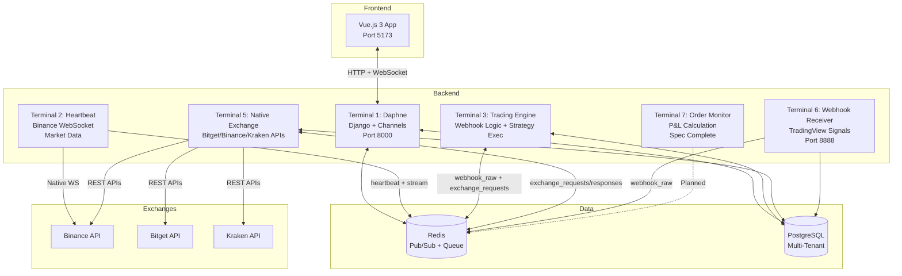

# Aristobot3.1 Codebase Map

> Auto-generated by Cartographer. Last mapped: 2026-02-05 (Audit pass post Module 4)

## System Overview

Aristobot3.1 is a personal crypto trading bot built with Django/Vue.js, supporting multi-exchange automated trading strategies. The architecture follows a **7-terminal microservice** pattern with native exchange APIs for high performance (~3x faster than CCXT).

**Philosophy**: "Vibe Coding" — Pragmatic > Enterprise, Shipping > Process, Fun > Perfection

**Scale**: 5 users max, 20 active strategies limit

**Status**: Modules 1-4 Complete | Modules 5-8 Planned



---

## Directory Structure

```
Aristobot3/
├── backend/
│   ├── aristobot/                    # Django project config
│   │   ├── settings.py              # Central config (Loguru interceptor, CORS, Channels, DRF)
│   │   ├── asgi.py                  # ASGI entry for Daphne
│   │   ├── routing.py               # WebSocket URL routing (8 consumers)
│   │   └── urls.py                  # HTTP URL routing (includes all apps)
│   ├── apps/
│   │   ├── core/                    # Core services, models, terminal commands
│   │   │   ├── models.py            # HeartbeatStatus, Position, CandleHeartbeat
│   │   │   ├── consumers.py         # 4 WS consumers: Heartbeat, Stream, Backtest, UserAccount
│   │   │   ├── views.py             # Heartbeat history/status REST APIs
│   │   │   ├── services/
│   │   │   │   ├── __init__.py               # Re-exports all native clients + ExchangeClient (see Gotcha #14)
│   │   │   │   ├── base_exchange_client.py    # ExchangeClientFactory + BaseExchangeClient
│   │   │   │   ├── bitget_native_client.py    # Bitget v2 Spot (HMAC-SHA256, OCO, tpsl_type)
│   │   │   │   ├── binance_native_client.py   # Binance v3 Spot (weight rate limiting)
│   │   │   │   ├── kraken_native_client.py    # Kraken v0 (HMAC-SHA512, userref int32 hash)
│   │   │   │   ├── native_exchange_manager.py # Pool manager + Redis request loop
│   │   │   │   ├── exchange_client.py         # Unified async client (Redis req/resp wrapper)
│   │   │   │   ├── redis_fallback.py          # Redis connection helper (see Gotcha #15)
│   │   │   │   ├── loguru_config.py           # Centralized Loguru setup + trace_id injection
│   │   │   │   ├── symbol_updater.py          # Background symbol sync via CCXT metadata (active)
│   │   │   │   ├── symbol_updater_fixed.py    # DEPRECATED duplicate — do not import (see Gotcha #16)
│   │   │   │   └── symbol_updater_backup.py   # DEPRECATED duplicate — do not import (see Gotcha #16)
│   │   │   └── management/commands/
│   │   │       ├── run_heartbeat.py           # Terminal 2
│   │   │       ├── run_native_exchange_service.py  # Terminal 5
│   │   │       ├── run_trading_engine.py      # Terminal 3 (webhook logic + strategy stub)
│   │   │       ├── run_webhook_receiver.py    # Terminal 6 (aiohttp, NEW Module 4)
│   │   │       └── run_order_monitor.py       # Terminal 7 (spec complete, not yet active)
│   │   ├── accounts/                # Extended User model + init_aristobot
│   │   ├── auth_custom/             # DebugMode singleton + debug login/logout endpoints
│   │   ├── brokers/                 # Broker + ExchangeSymbol models, CRUD views
│   │   ├── trading_manual/          # Trade model, services, 4 consumers, views
│   │   │   └── utils/
│   │   │       └── position_notifications.py  # T7 → frontend WebSocket bridge (unused until T7 active)
│   │   ├── webhooks/                # Webhook + WebhookState models, REST APIs (NEW Module 4)
│   │   ├── market_data/             # Placeholder
│   │   ├── strategies/              # Placeholder (Module 5)
│   │   ├── trading_engine/          # Placeholder (Module 7)
│   │   ├── backtest/                # Placeholder (Module 6)
│   │   └── stats/                   # Placeholder (Module 8)
│   └── manage.py
├── frontend/
│   ├── index.html                   # Vite entry (at root, NOT public/)
│   ├── vite.config.js               # Vue runtime alias + feature flags
│   ├── package.json                 # Vue 3.4, Vite 5, Pinia 2.1, Axios 1.6
│   └── src/
│       ├── main.js                  # App init + Vue Router (9 routes)
│       ├── App.vue                  # Root layout: Sidebar + StatusBar + router-view
│       ├── stores/auth.js           # Pinia auth store (login, logout, debugLogin, checkAuth)
│       ├── api/index.js             # Axios instance (baseURL + withCredentials + CSRF)
│       ├── services/logger.js       # Frontend log shipper → backend (see Gotcha #17)
│       ├── design-system/tokens.js  # Dark neon theme tokens
│       ├── components/
│       │   ├── Sidebar.vue          # Left nav menu (9 pages)
│       │   └── StatusBar.vue        # Top bar: Heartbeat indicator, exchanges, debug badge
│       └── views/
│           ├── LoginView.vue        # Session auth + debug mode toggle
│           ├── AccountView.vue      # Broker CRUD modal + capabilities + MAJ Paires
│           ├── HeartbeatView.vue    # Stream (raw) + timeframe cards (historical orange / live green)
│           ├── TradingManualView.vue # Portfolio + order form + orders list (largest view, ~50k tokens)
│           ├── WebhooksView.vue     # Webhook monitor + open positions (NEW Module 4)
│           ├── TradingBotView.vue   # Placeholder stub (58 lines)
│           ├── StrategiesView.vue   # Placeholder stub (58 lines)
│           ├── BacktestView.vue     # Placeholder stub (58 lines)
│           └── StatsView.vue        # Placeholder stub (57 lines)
├── logs/                            # Loguru per-terminal JSON logs (rotation 2min, retention 10min)
├── docs/                            # This file + design docs + graphml diagrams
├── .env                             # Runtime config (SECRET_KEY, REDIS_HOST, WEBHOOK_TOKEN, DEBUG_ARISTOBOT)
├── CLAUDE.md                        # AI context loader — imports key files
├── DEVELOPMENT_RULES.md             # 6 non-negotiable architectural rules
├── Aristobot3_1.md                  # Main developer guide (architecture, workflows, all apps)
└── IMPLEMENTATION_PLAN.md           # Module roadmap and completion checklist
```

---

## Logging Infrastructure (Loguru) — Added Module 4

All terminal processes share one configuration entry point: `apps/core/services/loguru_config.py`.

```
Management command startup:
    setup_loguru("terminal2")  →  logs/terminal2.log  (JSON, 2-min rotation, 10-min retention)
    setup_loguru("terminal3")  →  logs/terminal3.log
    setup_loguru("terminal5")  →  logs/terminal5.log
    setup_loguru("terminal6")  →  logs/terminal6.log

Daphne process (settings.py interceptor):
    _LoguruInterceptHandler on apps.* loggers  →  logs/terminal1.log
```

**Key features:**
- **Per-terminal files**: Each management command calls `setup_loguru(name)` at startup
- **JSON serialized**: File handler uses `serialize=True` for structured log parsing
- **Rotation/retention**: 2-minute rotation, 10-minute retention (~5 files per terminal)
- **trace_id propagation**: T6 generates a UUID per webhook. The trace_id travels T6 → Redis → T3 → ExchangeClient request → T5, bound at each hop via `logger.bind(trace_id=...)`. In T5, a `contextvars.ContextVar` injects it into every log record automatically via a filter function.
- **Django interceptor**: `settings.py` detects if running under Daphne (`'daphne' in sys.argv[0]`). If so, installs a custom `logging.Handler` on all `apps.*` loggers that forwards to Loguru with `terminal_name="terminal1"`.
- **Level control**: `ARISTOBOT_LOG_LEVEL` env var (default `INFO`, set `DEBUG` for verbose)

---

## Terminal Services

### Terminal 1: Web Server (Daphne)

**Command**: `daphne aristobot.asgi:application` | **Port**: 8000 | **Status**: Active

Django ASGI server. Handles all HTTP REST APIs and WebSocket connections. Loguru interceptor collects app logs → `terminal1.log`.

**WebSocket routes** (`aristobot/routing.py` — 8 consumers):

| URL Pattern | Consumer | Source File | Group Name | Purpose |
|-------------|----------|-------------|------------|---------|
| `ws/heartbeat/` | HeartbeatConsumer | core/consumers.py | `heartbeat` | Closed-candle signals |
| `ws/stream/` | StreamConsumer | core/consumers.py | `stream` | Raw Binance data |
| `ws/backtest/` | BacktestConsumer | core/consumers.py | `backtest` | Backtest progress % |
| `ws/user-account/` | UserAccountConsumer | core/consumers.py | `user_account_updates` | Market load progress |
| `ws/trading-manual/` | TradingManualConsumer | trading_manual/consumers.py | `trading_manual_{user_id}` | Portfolio price updates |
| `ws/open-orders/` | OpenOrdersConsumer | trading_manual/consumers.py | `open_orders_{user_id}` | Order status sync |
| `ws/trading-notifications/` | TradingNotificationsConsumer | trading_manual/consumers.py | `trading_notifications_{user_id}` | Execution success/error |
| `ws/terminal7-monitoring/` | Terminal7MonitoringConsumer | trading_manual/consumers.py | `terminal7_monitoring_{user_id}` | P&L updates (T7) |

---

### Terminal 2: Heartbeat Service

**File**: `apps/core/management/commands/run_heartbeat.py` | **Command**: `python manage.py run_heartbeat` | **Status**: Active

Native WebSocket to `wss://stream.binance.com:9443`. Subscribes: `btcusdt@kline_1m/3m/5m/15m/1h/4h`.

On each message:
- Broadcasts raw JSON → Django Channels group `stream`

On candle close (`k['x'] == true`):
1. Saves `CandleHeartbeat` record (OHLCV + reception/candle timestamps)
2. Broadcasts processed signal → Django Channels group `heartbeat`

Lifecycle: `HeartbeatStatus.record_start()` on boot, `.record_stop()` on shutdown.

---

### Terminal 3: Trading Engine (v2.0)

**File**: `apps/core/management/commands/run_trading_engine.py` | **Command**: `python manage.py run_trading_engine` | **Status**: Active

Two parallel `asyncio` listeners via `asyncio.gather`:

**1. `listen_heartbeat()`** — Subscribes to Redis `heartbeat` Pub/Sub. Currently a placeholder (logs in verbose only). Module 7 will implement strategy execution here.

**2. `listen_webhooks()`** — Subscribes to Redis `webhook_raw` Pub/Sub. Full Module 4 logic:

```
Receive message from webhook_raw
    ├── Extract trace_id (propagated from T6)
    ├── Parse payload fields (Symbol, Action, Prix, PourCent, UserID, UserExchangeID)
    ├── Save Webhook record to DB (status='processing')
    ├── If Action == PING → mark processed, return
    ├── Load Broker, check type_de_trading == 'Webhooks' (else → error)
    ├── BuyMarket/SellMarket/BuyLimit/SellLimit:
    │   ├── Get USDT balance via ExchangeClient → Terminal 5
    │   ├── Calculate amount = balance * PourCent / 100
    │   ├── Normalize symbol (BTCUSDT → BTC/USDT)
    │   └── place_order via ExchangeClient → Terminal 5
    └── MAJ (SL/TP update):
        ├── Find open WebhookState for (user, broker, symbol)
        ├── Cancel existing SL order (if any) via ExchangeClient
        ├── Cancel existing TP order (if any) via ExchangeClient
        ├── Place new SL (stop_loss type) if PrixSL provided
        ├── Place new TP (take_profit type) if PrixTP provided
        └── Update WebhookState with new order IDs + prices
```

**Test mode**: `--test` flag skips actual order execution.

---

### Terminal 5: Native Exchange Gateway

**File**: `apps/core/management/commands/run_native_exchange_service.py` | **Command**: `python manage.py run_native_exchange_service` | **Status**: Active

Centralized hub for all exchange API calls. **One client per exchange type** (not per broker). Credentials decrypted and injected dynamically before each call.

**Client pool** (`NativeExchangeManager`):
```python
exchange_pool = {
    'bitget':   BitgetNativeClient(),   # HMAC-SHA256, OCO support
    'binance':  BinanceNativeClient(),  # Weight-based rate limits
    'kraken':   KrakenNativeClient(),   # HMAC-SHA512 + userref int32
}
```

**Supported actions**: `get_balance`, `get_markets`, `get_ticker`, `fetch_tickers`, `get_candles`, `place_order`, `cancel_order`, `edit_order`, `fetch_open_orders`, `fetch_closed_orders`, `test_connection`, `load_markets`, `create_and_execute_trade`

**Communication**: Reads from Redis list `exchange_requests` (blpop). Writes response to `exchange_response_{request_id}` (set with cleanup). Requesting services poll every 100ms with per-action timeouts (60-120s).

**Stats display**: Periodic (default 60s) summary of requests processed, success rate, avg response time, active exchanges.

---

### Terminal 6: Webhook Receiver (NEW — Module 4)

**File**: `apps/core/management/commands/run_webhook_receiver.py` | **Command**: `python manage.py run_webhook_receiver` | **Port**: 8888 | **Status**: Active

Lightweight `aiohttp` HTTP server with **zero business logic**. Purpose: receive → validate → persist → publish → respond fast.

**Endpoints:**
- `POST /webhook` — Main entry. Validates `X-Webhook-Token` header. Generates `trace_id` UUID. Saves `Webhook` record to DB (all fields extracted from JSON payload). Publishes to Redis `webhook_raw`. Returns `200 OK` with trace_id.
- `GET /health` — Monitoring endpoint. Returns Redis status + counters.

**Error resilience**: If DB save fails, still publishes to Redis (webhook processing continues).

---

### Terminal 7: Order Monitor

**File**: `apps/core/management/commands/run_order_monitor.py` (11k tokens) | **Status**: Spec complete, not yet active

Planned 10-second reconciliation loop per active broker:
1. Fetch open + closed orders from exchange via Terminal 5
2. Compare against `Trade` table
3. Import missing orders (flagged `source='order_monitor'`, note `'Ajoute par Terminal 7'`)
4. Detect newly filled orders → update status, calculate P&L
5. Push updates via WebSocket (`terminal7-monitoring` consumer)

---

## Module 4: Webhooks TradingView (NEW)

### Models (`apps/webhooks/models.py`)

**Webhook** — Complete audit trail of every TradingView signal:

| Field | Type | Notes |
|-------|------|-------|
| user, broker | FK | Multi-tenant |
| symbol | CharField | e.g. BTCUSDT |
| interval | CharField | 1m, 5m, 15m... |
| action | CharField | PING / BuyMarket / SellMarket / BuyLimit / SellLimit / MAJ / MISS |
| prix, prix_sl, prix_tp | DecimalField | Nullable |
| pour_cent | DecimalField | 0-100, default 100 |
| status | CharField | received / processing / processed / error / miss |
| raw_payload | JSONField | Original TradingView JSON |
| order_id | CharField | Exchange order ID after execution |
| execution_result | JSONField | Full exchange response |
| bar_time | DateTimeField | TradingView candle timestamp |

**WebhookState** — Active position tracker (max 1 open per user/broker/symbol):

| Field | Type | Notes |
|-------|------|-------|
| user, broker | FK | Multi-tenant |
| symbol | CharField | Trading pair |
| status | CharField | open / closed |
| entry_price, quantity, side | Decimal/Char | Position details |
| current_sl, current_tp | DecimalField | Current stop/target prices |
| sl_order_id, tp_order_id | CharField | Active SL/TP order IDs on exchange |
| unrealized_pnl, realized_pnl | DecimalField | P&L tracking |
| opening_webhook | FK → Webhook | Which webhook opened this position |

### REST APIs (`apps/webhooks/urls.py`)

| Endpoint | Method | Description |
|----------|--------|-------------|
| `/api/webhooks/` | GET | Paginated list (filterable: symbol, action, status, broker) |
| `/api/webhooks/{id}/` | GET | Single webhook detail |
| `/api/webhooks/stats/` | GET | Aggregated stats. `?period=24h|7d|30d&broker_id=N` |
| `/api/webhooks/recent/` | GET | Last 20 webhooks |
| `/api/webhook-states/` | GET | All webhook positions |
| `/api/webhook-states/open/` | GET | Open positions only |
| `/api/webhook-states/summary/` | GET | Open count + total unrealized P&L + active symbols |

### Frontend: WebhooksView.vue

**Layout**: 4 stat cards (total, success rate, errors, open positions) above a 2-column grid:
- Left (2fr): Webhooks table — Date, Exchange, Symbol, Action badge, Price, %, Status badge, Order ID
- Right (1fr): Open Positions table — Symbol, Side, Qty, Entry, Current, SL, TP, P&L

**Interaction**: Broker filter dropdown + period selector (24h/7d/30d). New webhooks highlighted green for 3s. Max 100 items. Auto-refresh 5s (polling).

**Note**: Uses polling rather than WebSocket. A `WebhookConsumer` should be added to `routing.py` for live updates per DEVELOPMENT_RULES Rule #1.

### Broker type_de_trading

Migration `brokers/0002_broker_type_de_trading` adds:
```python
type_de_trading = CharField(choices=[('OFF','Desactive'), ('Strategie','Strategies'), ('Webhooks','Webhooks TradingView')], default='OFF')
```
Terminal 3 gates all webhook order execution on `broker.type_de_trading == 'Webhooks'`. If not set, the webhook is marked `error` and logged.

---

## Modules 1-3 (Previously Mapped — Summaries)

### Module 1: User Account & Brokers (Complete)

**Apps**: `accounts`, `auth_custom`, `brokers`

- Extended User model with `default_broker`, `ai_provider`, `ai_api_key`, `display_timezone`
- DebugMode singleton: `.env` `DEBUG_ARISTOBOT=True` + DB flag → auto-login as "dev"
- Broker CRUD: Fernet-encrypted API keys (SECRET_KEY[:32]). Test connection via T5. Symbol loading triggered by `[MAJ Paires]` button per broker.
- `ExchangeSymbol` shared table: updated per-broker (not global batch)
- Init: `python manage.py init_aristobot` → users "dev" + "dac"

### Module 2: Heartbeat Enhanced (Complete)

**App**: `core` (models + command + consumers + views)

- `CandleHeartbeat`: OHLCV per closed candle with dual timestamps
- Dual WebSocket channels: `stream` (raw feed) + `heartbeat` (processed signals)
- HeartbeatView: loads 240 historical signals (orange), live signals prepended green via WebSocket `unshift()`
- REST: `/api/heartbeat/status/`, `/api/heartbeat/heartbeat-history/`, `/api/heartbeat/signals/`

### Module 3: Trading Manual (Complete)

**App**: `trading_manual` (model + services + 4 consumers + views)

- `Trade` model: complete order history. Terminal 5 is master of persistence via `create_and_execute_trade`
- 3-column layout: Portfolio (batch-priced via single `get_tickers()`) | Symbol selector + order form | Order history
- Two-step validation: Validate (opens 15s window) → Execute
- Bidirectional calculator: quantity ↔ USD amount
- Symbol filter: USDT / USDC / All + search with debounce
- 4 WebSocket consumers for real-time updates

---

## Redis Channels Reference

| Channel | Type | Published By | Read By | Content |
|---------|------|-------------|---------|---------|
| `stream` | Pub/Sub (Django Channels) | Terminal 2 | Frontend HeartbeatView | Raw Binance kline JSON |
| `heartbeat` | Pub/Sub (Django Channels) | Terminal 2 | Terminal 3, Frontend HeartbeatView | Processed closed-candle signal |
| `webhook_raw` | Pub/Sub (Redis native) | Terminal 6 | Terminal 3 | `{payload, received_at, trace_id}` |
| `exchange_requests` | List (rpush/blpop) | All via ExchangeClient | Terminal 5 | `{request_id, action, params, user_id}` |
| `exchange_response_{uuid}` | String (set/get) | Terminal 5 | Requesting service | `{success, data/error}` — deleted after read |
| `user_account_updates` | Pub/Sub (Django Channels) | Terminal 5 | Frontend AccountView | Market load progress/success |
| `trading_manual_{user_id}` | Pub/Sub (Django Channels) | TradingService | Frontend TradingManualView | Order notifications |

**Note on two Pub/Sub systems**: Heartbeat and trading_manual consumers use Django Channels (backed by Redis via `channels_redis`). Terminal 3/6 use raw `redis.asyncio` Pub/Sub directly. They are independent — Django Channels groups are not visible to raw Redis SUBSCRIBE.

---

## Database Schema

```
users ─────────┬──── brokers ─────────┬── active_strategies (Module 7)
               │                      │
               │                      ├── trades (source: manual/strategy/webhook/order_monitor)
               │                      │
               ├── webhooks ──────────┤
               │                      └── webhook_states
               │
               └── strategies (Module 5)

Shared tables (no user FK):
    heartbeat_status   (singleton, id=1)
    candles_heartbeat  (OHLCV history)
    exchange_symbols   (per-exchange symbol catalog)
    debug_mode         (singleton, id=1)
```

**Key models by app:**

| App | Model | Table | Key Fields |
|-----|-------|-------|------------|
| core | HeartbeatStatus | heartbeat_status | is_connected, last_application_start/stop |
| core | CandleHeartbeat | candles_heartbeat | signal_type, OHLCV, dhm_reception/candle |
| core | Position | positions | user, broker, symbol, side, qty, entry/current price, SL, TP, P&L |
| accounts | User | accounts_user | default_broker, ai_provider, display_timezone |
| auth_custom | DebugMode | debug_mode | is_active (singleton) |
| brokers | Broker | brokers | user, exchange, encrypted keys, type_de_trading, is_default |
| brokers | ExchangeSymbol | exchange_symbols | exchange, symbol, base/quote, precision, limits |
| trading_manual | Trade | trades | user, broker, symbol, side, qty, price, status, source, raw exchange response |
| webhooks | Webhook | webhooks | user, broker, action, prix/SL/TP, pour_cent, status, raw_payload, execution_result |
| webhooks | WebhookState | webhook_states | user, broker, symbol, position details, SL/TP order IDs, P&L |

---

## Conventions

### Python
- `# -*- coding: utf-8 -*-` mandatory first line (Windows compatibility)
- ASCII only in identifiers; accents in strings/comments OK
- `asyncio` for all concurrent I/O — Celery is excluded
- Django ORM only (no raw SQL)
- `Decimal` for all financial values — never float
- Multi-tenant: every queryset includes `.filter(user=request.user)`

### Vue.js
- Composition API **only** — Options API is forbidden
- `ref()` for state, `computed()` for derived, `onMounted()` / `onUnmounted()` for lifecycle
- WebSocket data prepended via `unshift()`, not array replacement
- Design tokens mandatory: `#00D4FF` primary, `#00FF88` success, `#FF0055` danger
- Dark theme only (desktop-first responsive)

### API
- REST paths: `/api/{app}/{resource}/`
- WebSocket paths: `/ws/{feature}/`
- Auth: `CsrfExemptSessionAuthentication` (DRF) — session cookies, no CSRF check on API
- Errors in French (technical + debuggable)

---

## Gotchas

### 1. Webhook Double-Save (Known Bug)
Terminal 6 saves every webhook to DB on receipt (`status='received'`). Terminal 3 creates a **second** `Webhook` record (`status='processing'`). Two rows exist for the same signal. Fix: T3 should fetch the existing record (by trace_id or timestamp match) and update it instead of inserting.

### 2. WebhooksView Uses Polling, Not WebSocket
`WebhooksView.vue` polls `/api/webhooks/recent/` every 5s. Per Rule #1 (DEVELOPMENT_RULES), live webhook data must use WebSocket. No `WebhookConsumer` exists in `routing.py` yet. Migration path: add consumer to `core/consumers.py` + route, broadcast on webhook save.

### 3. Two Independent Pub/Sub Systems
Django Channels consumers (HeartbeatView, TradingManualView) use `channel_layer.group_send()`. Terminal 3 and 6 use raw `redis.asyncio` Pub/Sub (`subscribe`/`publish`). These are **not** interchangeable — Django Channels groups are invisible to raw Redis SUBSCRIBE and vice versa.

### 4. Migrations Order
`accounts` app must migrate first (`AUTH_USER_MODEL = 'accounts.User'`). Then `brokers`, `core`, `trading_manual`, `webhooks` in any order.

### 5. index.html Location
Vite requires `frontend/index.html` at the project root (not `public/`). Moving it breaks the build.

### 6. Vue Runtime Compiler
`vite.config.js` aliases `vue` → `vue/dist/vue.esm-bundler.js`. Without this, string templates fail.

### 7. CORS + Session Cookies
Frontend: `withCredentials: true`. Backend: `CORS_ALLOW_CREDENTIALS = True` + explicit origin list. `CORS_ALLOW_ALL_ORIGINS = False` is enforced.

### 8. Terminal 5 Shared Clients
Two brokers on the same exchange share one native client. Credentials are injected per-request (decrypt → set → call). No mutex — safe because each request is a single `await` with no interleaving.

### 9. Decimal Everywhere
DB uses `DecimalField(max_digits=20, decimal_places=8)`. Python code uses `Decimal(str(...))` when converting from float inputs (e.g. exchange responses). Never `Decimal(float_value)`.

### 10. Redis Key Cleanup
`exchange_response_{uuid}` is deleted immediately after read. If the requesting service crashes before reading, the key persists until Redis maxmemory eviction. Add TTL on set as a safety net.

### 11. CCXT: Metadata Only
CCXT is used for exchange catalog (`ccxt.exchanges`) and credential discovery (`requiredCredentials`) only. All real trading API calls route through native clients via Terminal 5. The `Broker.get_ccxt_client()` method is deprecated.

### 12. trace_id Is Process-Local
trace_id propagates via data payloads (Redis messages, ExchangeClient request dicts), not via shared memory. Each process binds it to its own Loguru context. It does **not** flow through Django Channels WebSockets.

### 13. Loguru Only in Daphne for Terminal 1
The Loguru interceptor in `settings.py` checks `'daphne' in sys.argv[0]` before activating. Management commands (T2/T3/T5/T6) call their own `setup_loguru()` and must not re-trigger the Django interceptor setup.

### 14. `services/__init__.py` Eager Imports
`apps/core/services/__init__.py` eagerly imports all native clients and models at package load time. In contexts where Django apps aren't fully initialised yet (e.g. early `settings.py` execution), importing from `apps.core.services` raises `AppRegistryNotReady`. This is why `settings.py` loads `loguru_config` via `importlib` file-path rather than a package import. Any new code that runs before `django.setup()` must follow the same pattern.

### 15. `redis_fallback.py` Ignores `REDIS_HOST`
`get_redis_client()` hardcodes `host='localhost', port=6379`. The rest of the codebase reads `REDIS_HOST` / `REDIS_PORT` from `.env` / Django settings. If Redis is on a remote host (the DB is on `10.9.0.99` — Redis may be too), this factory connects to the wrong server. Fix: read from `django.conf.settings` or environment before constructing the client.

### 16. Duplicate `symbol_updater` Files
Three copies exist: `symbol_updater.py` (canonical, imported by `__init__.py`), `symbol_updater_fixed.py` (has `safe_decimal_value()` guard, not imported anywhere), `symbol_updater_backup.py` (original without the guard, crashes on large exchange values). Only `symbol_updater.py` is in the import chain. The other two should be deleted or moved to `_archives/`.

### 17. `frontend/src/services/logger.js` — Dead Endpoint
`logger.js` ships log entries to `POST /api/frontend-log`, but no such endpoint is registered in any `urls.py`. Every log call silently falls back to `console.warn` after 3 retries. Either wire up the backend endpoint or remove the service until it is needed.

### 18. `WebhookState` Missing `current_price` Field
`WebhookStateViewSet.summary` action iterates open positions and references `position.current_price` to compute total unrealized P&L. `WebhookState` has no `current_price` column — this endpoint will raise `AttributeError` at runtime. Needs either a model field added or the price fetched live from T5 before the calculation.

### 19. `WebhookSerializer.exchange_name` Shadows Model Field
The serializer declares `exchange_name = CharField(source='broker.exchange')` which always returns the broker's exchange type (e.g. `"bitget"`). The `Webhook` model has its own `exchange_name` column populated from the TradingView payload (e.g. `"Binance"`). The API response silently returns the wrong value. Remove the explicit serializer field to let the ModelSerializer use the model column, or rename one of them.

### 20. `TradingManualConsumer` Creates `ExchangeClient` Without `user_id`
In `trading_manual/consumers.py`, `TradingManualConsumer.heartbeat_message()` instantiates `ExchangeClient()` with no `user_id`. The multi-tenant security check in `ExchangeClient._send_request()` is bypassed. Pass `user_id=self.scope['user'].id` at construction time.

---

## Navigation Guide

### To add a new exchange
1. `apps/core/services/{exchange}_native_client.py` — inherit `BaseExchangeClient`, implement all methods
2. `base_exchange_client.py` — register in `ExchangeClientFactory.CLIENTS`
3. `native_exchange_manager.py` — add status mapping
4. `brokers/models.py` — add to `EXCHANGE_CHOICES`

### To add a new WebSocket consumer
1. Create consumer in `apps/{app}/consumers.py` (inherit `AsyncWebsocketConsumer`)
2. Add route to `aristobot/routing.py`
3. Connect in frontend view `onMounted()` with reconnect logic

### To add a new REST endpoint
1. ViewSet/APIView in `apps/{app}/views.py`
2. Register router in `apps/{app}/urls.py`
3. Include URL conf in `aristobot/urls.py`

### To add a new Terminal service
1. `apps/core/management/commands/run_{name}.py` — BaseCommand subclass
2. Call `setup_loguru("terminal{N}")` in `handle()`
3. Signal handlers for graceful shutdown
4. Create Windows startup `.bat` script
5. Document Redis channels in this map

### To implement Module 5 (Strategies)
- `apps/strategies/` registered in INSTALLED_APPS — add models, views, serializers
- Strategy model: user, name, code (TextField), timeframe
- Frontend: code editor (Monaco or CodeMirror), syntax validation via `ast.parse()`
- AI assistant: OpenRouter/Ollama config already in User model
- Base class `Strategy` with `should_long()`, `should_short()`, `calculate_position_size()`, etc.

### To implement Module 7 (Trading Bot)
- `apps/trading_engine/` registered — add `ActiveStrategy` model
- Full implementation goes in `run_trading_engine.py` → `listen_heartbeat()` method
- Pattern: receive signal → load active strategies matching timeframe → for each: load code from DB → `exec()` in isolated namespace → `issubclass` to find Strategy subclass → instantiate with candles/balance → call decision methods → route orders to T5

---

## Project Health (2026-02-05)

| Module | Name | Status | Notes |
|--------|------|--------|-------|
| 1 | User Account & Brokers | Complete | type_de_trading field added |
| 2 | Heartbeat Enhanced | Complete | |
| 3 | Trading Manual | Complete | |
| 4 | Webhooks TradingView | Complete | T6 receiver + T3 logic + WebhooksView |
| 5 | Strategies | Placeholder | Needs: model, editor, AI, validation |
| 6 | Backtest | Placeholder | Needs: model, sim engine, progress WS |
| 7 | Trading Bot | Placeholder | T3 heartbeat listener is stub |
| 8 | Statistics | Placeholder | Needs: aggregation, charts |

| Terminal | Name | Status |
|----------|------|--------|
| 1 | Daphne (Web) | Active |
| 2 | Heartbeat | Active |
| 3 | Trading Engine | Active (webhooks done, strategies pending) |
| 4 | Frontend (Vite) | Active |
| 5 | Exchange Gateway | Active |
| 6 | Webhook Receiver | Active (NEW) |
| 7 | Order Monitor | Spec only |

**Technical debt:**
- Webhook double-save (T6 + T3 both insert) — Gotcha #1
- WebhooksView polling vs WebSocket — Gotcha #2
- `redis_fallback.py` hardcodes localhost — Gotcha #15
- `symbol_updater_fixed.py` + `symbol_updater_backup.py` dead duplicates — Gotcha #16
- `services/logger.js` ships to unregistered endpoint — Gotcha #17
- `WebhookState.current_price` missing; `summary` endpoint crashes — Gotcha #18
- `WebhookSerializer.exchange_name` returns wrong value — Gotcha #19
- `TradingManualConsumer` bypasses multi-tenant check — Gotcha #20
- `backend/` root littered with ~30 debug/test scripts (`test_*.py`, `debug_*.py`, `check_*.py`) — candidates for cleanup or move to `tests/`
- No automated tests
- No CI/CD
- Some views use `alert()` instead of toast notifications

---

**Generated by**: Claude Code Cartographer
**Date**: 2026-02-05
**Trigger**: Audit pass — subagent review of all Module 4 files and services layer. No code changes since 2026-02-04; map updated with 7 new gotchas and deprecated-file annotations discovered during review.
